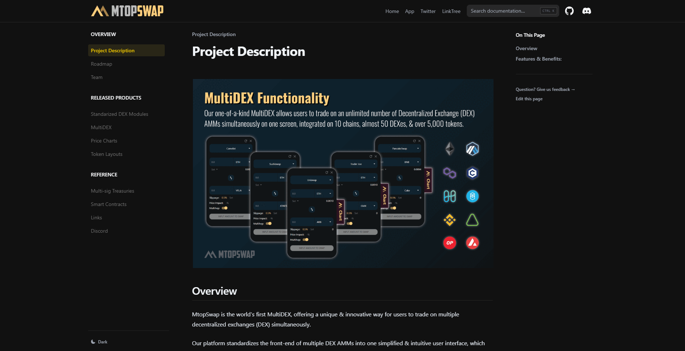

# MtopSwap Documentation Deployment 

This is the final deployment for migrating documentation to docs.mtopswap.com, utilizing the [Nextra Documentation Builder](https://nextra.site).

[** Deployment Link →**](https://docs.mtopswap.com/)

## Local Development

First, run `npm install` to install the dependencies.

Then, run `npm run dev` to start the development server and visit localhost:3000.

## License

This project is licensed under the MIT License.
